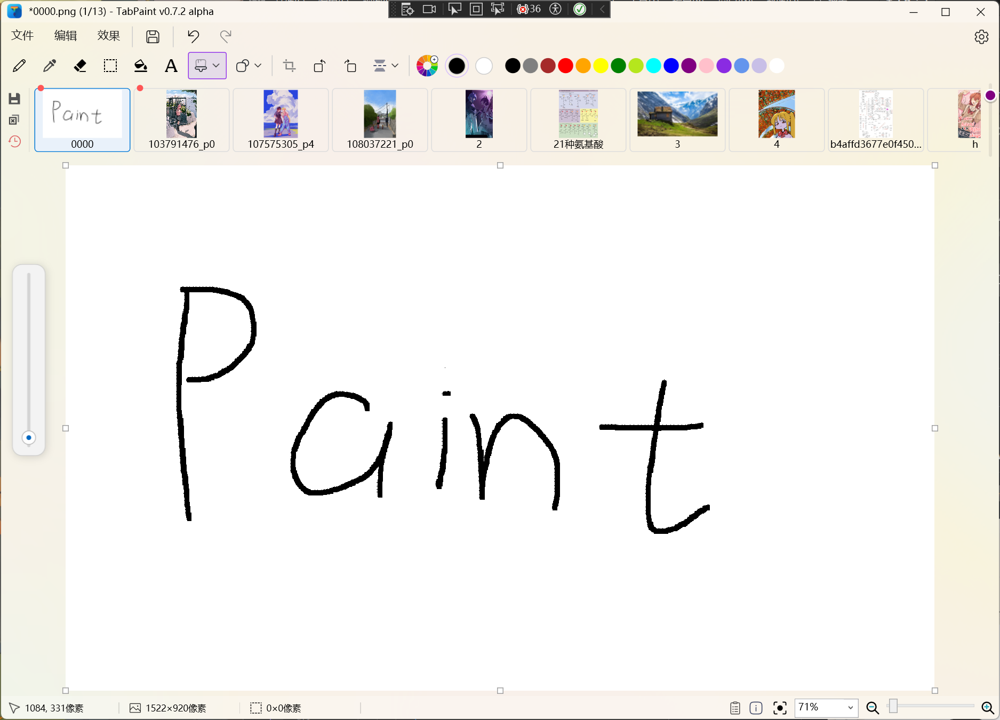

# 🎨 TabPaint (Alpha)

   



> **English** | [中文](#chinese)

---

## 🇬🇧 English Introduction

**TabPaint** is a lightweight image editor and viewer tailored for Windows, built with C#, WPF (.NET), and Win32 APIs (DWM/WindowChrome).

It is designed for the **"10-second edit" workflow**: when you just need to screenshot, circle a highlight, add a note, and paste it into a document. It combines the familiarity of the classic MS Paint with modern efficiency features like **browser-style tabs** and seamless drag-and-drop integration.

### 🚧 Alpha Warning (v0.7.2)
**Current Status: Active Development**
This software is currently in the **Alpha Testing** stage. 
*   ⚠️ **Stability**: v0.7.2 introduces many new features. There is a known issue where clearing the runtime cache on exit may occasionally cause a crash.
*   ⚠️ **ImageBar**: The thumbnail slider logic is under refactoring; scrolling behavior on the ImageBar might be inconsistent.
*   **Recommendation**: Great for quick edits and screenshots. Please save often!

### ✨ Key Features (v0.7.x)
*   **Multi-Tab Interface (ImageBar)**: 
    *   **Browser-like experience**: `Ctrl+W` to close, Middle-click to close.
    *   **Clipboard Monitor**: Toggle on the bottom bar to auto-paste new clipboard content.
    *   **Smart Paste**: `Ctrl+Shift+V` to paste as a new tab instantly.
*   **Modern UI & UX**: 
    *   **Filter Window**: Newly beautified interface for image adjustments.
    *   **Rich Info Bar**: Displays dimensions, DPI, and EXIF data on hover.
    *   **Visual Feedback**: Purple highlight borders for active tools.
*   **Seamless Workflow**: 
    *   **Drag & Drop**: Drag files into the canvas to open as new tabs; drag selection out to create files.
    *   **Context Menu**: Right-click thumbnails to "Open File Location".
*   **Canvas Control**: 
    *   8-point handle system for resizing.
    *   Auto-expand canvas when pasting large images.

### 🗺️ Roadmap & Status

| Feature | Status | Note |
| :--- | :---: | :--- |
| **Multi-Tab System** | ✅ | Stable. Added `Ctrl+W`, `Ctrl+Shift+V` in v0.7.1. |
| **Basic Tools** | ✅ | Pencil, Brush, Shapes (Circle/Rect), Crop. |
| **Filters & Adjustments** | ✅ | Beautified UI in v0.7.1. |
| **Clipboard Monitor** | ✅ | Toggle added to bottom bar (v0.7.1). |
| **Viewer/Editor Split** | 📅 | **Target for v0.8**: Separate "View Mode" (dark bg, no UI). |
| **Advanced Brushes** | 📅 | **Target for v0.9**: High-performance rendering, custom cursors. |
| **Transparency** | 🔨 | **In Progress**: Alpha channel support & checkerboard bg. |
| **High DPI Support** | 🐛 | Improving. Selection borders on >100% scaling still need tweaks. |
| **Settings Page** | 🚧 | Basic "About/Settings" skeleton added. |

### 🐛 Known Issues (v0.7.2)
*   **Crash on Exit**: Occasional crash related to deleting runtime cache files.
*   **ImageBar Slider**: Scroll wheel support on the slider is missing or buggy; slider end-point calculation errors.
*   **File Numbering**: "Untitled" file numbering logic (1, 2 -> 3) needs optimization after closing tabs.
*   **Large Images**: Very large images (>16k) may trigger compression warnings or select tool lag.

---
<a name="chinese"></a>

## 🇨🇳 中文介绍

**TabPaint** 是一款基于 C# WPF 和 Win32 API (DWM) 开发的现代化 Windows 图片编辑与查看工具。

它的开发初衷是为了解决 **“10秒内快速修图”** 的痛点：当你只需要截图、圈出重点、写个备注，然后发给同事或插入文档时，PS 太重，原生画图不支持多开。TabPaint 完美结合了经典画图的低上手门槛和类似浏览器的多标签页体验。

### 🚧 Alpha 版本预警 (v0.7.2)
**当前状态：活跃开发中**
本项目目前处于 **Alpha 内测阶段**。
*   ⚠️ **稳定性**：v0.7.2 引入了大量新特性。已知退出程序时清理缓存文件可能偶发崩溃。
*   ⚠️ **导航栏**：ImageBar 的滑动条逻辑正在重构，滚轮滚动支持可能不稳定。
*   **建议**：非常适合日常截图标注和轻量修图，建议养成随手保存的习惯。

### ✨ 核心功能 (v0.7.x)
*   **多标签页系统 (ImageBar)**：
    *   **类浏览器操作**：支持 `Ctrl+W` 关闭标签，鼠标中键关闭。
    *   **剪贴板监听**：底部栏开关，开启后复制图片自动新建标签页。
    *   **极速粘贴**：`Ctrl+Shift+V` 直接将剪贴板内容粘贴为新标签页。
*   **现代 UI/UX**：
    *   **美化滤镜窗口**：全新设计的调整界面。
    *   **详细信息栏**：鼠标悬浮显示图片尺寸、DPI、EXIF 等信息。
    *   **视觉反馈**：工具选中时显示紫色强调边框。
*   **无缝工作流**：
    *   **拖拽交互**：多文件拖入 Canvas 自动变为新标签页；右键缩略图可“打开所在文件夹”。
    *   **文件输出**：框选区域直接拖出到桌面生成文件。
*   **画布控制**：
    *   支持 8 向拖拽手柄调整大小。
    *   粘贴大图时画布自动智能扩容。

### 🗺️ 开发计划与进度

| 功能特性 | 状态 | 说明 |
| :--- | :---: | :--- |
| **多标签页支持** | ✅ | v0.7.1 新增 Ctrl+W 关闭，Ctrl+Shift+V 粘贴为新页。 |
| **基础绘图工具** | ✅ | 铅笔、形状（圆/矩形）、裁剪工具。 |
| **滤镜与调整** | ✅ | v0.7.1 完成滤镜窗口 UI 美化。 |
| **剪贴板监听** | ✅ | 底部栏新增监听开关。 |
| **看图模式** | 📅 | **v0.8 目标**：看图/画图模式分离，沉浸式看图。 |
| **高级笔刷引擎** | 📅 | **v0.9 目标**：优化笔刷算法（蜡笔、毛刺感）。 |
| **透明背景支持** | 🔨 | **进行中**：透明度绘图与灰白格子背景。 |
| **高分屏适配** | 🐛 | 持续优化中，125%/150% 缩放下的选区错位问题正在修复。 |
| **设置界面** | 🚧 | 已添加基础的关于/设置页面框架。 |

### 🐛 已知问题 (v0.7.2)
*   **退出崩溃**：运行时删除缓存文件或强制结束进程时，可能导致程序崩溃或图片无法恢复。
*   **滑动条 Bug**：ImageBar 的 Slider 滚轮滚动未完全实装，末端比例计算有误。
*   **未命名编号**：新建、关闭、再新建未命名图片时，编号逻辑（Untitled-X）可能出现跳号或重置错误。
*   **超大图**：16k+ 分辨率图片可能会触发压缩警告，选区工具可能出现粘连。

### 📜 最近更新 (Changelog)

<details>
<summary>点击展开 v0.7.x 更新日志</summary>

**v0.7.2 Alpha (Current)**
*   修复：修复右键 ImageBar 粘贴功能。
*   修复：拖拽排序后序号更新逻辑。
*   已知问题：Slider 滚轮滚动及末端显示 Bug。

**v0.7.1**
*   新增：`Ctrl+W` 快捷键关闭标签页。
*   新增：`Ctrl+Shift+V` 粘贴为新标签页。
*   新增：底部栏剪贴板监听开关。
*   新增：ImageBar 缩略图右键菜单“打开所在文件夹”。
*   新增：多文件拖入 Canvas 全部作为新标签页打开。
*   优化：滤镜窗口 UI 美化。
*   优化：设置页面/关于页面雏形。

**v0.7.0**
*   新增：形状工具（圆形、矩形）。
*   新增：底部栏显示详细图片信息（鼠标悬浮）。
*   新增：拖入 Toolbar/Menu 切换工作区逻辑。
</details>

<details>
<summary>点击展开 v0.6.x 更新日志</summary>

**v0.6.4**
*   修复：中键关闭标签页体验优化。
*   新增：未命名图片自动编号逻辑。
*   优化：大量未保存图片的缓存与恢复逻辑。

**v0.6.1 - v0.6.3**
*   新增：画布边缘 8 向调整手柄。
*   新增：左侧工具栏清空/保存/放弃所有编辑按钮。
</details>

---

### 📥 Download / 下载
Please check the [Releases](../../releases) page for the latest build.
请前往 [Releases](../../releases) 页面下载最新构建版本。

### 🛠️ Build from Source / 源码构建
Environment:
*   Visual Studio 2022
*   .NET 6.0 / .NET 8.0 SDK (WPF Workload)

```bash
git clone https://github.com/YourUsername/TabPaint.git
cd TabPaint
dotnet build
